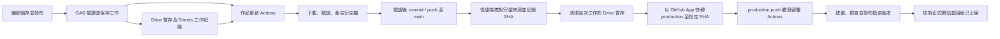

# 繪師作品上傳與資源管理提案

更新日期：2026-09-24。狀態：設計背景；第一版程式與離線驗證已完成，正式雲端尚未啟用。實際功能、限制與設定以[作品管理與發布服務](../development/artwork-service.md)為準，以下保留設計時的流程及取捨。

使用者已確認作品以 PNG、JPG、GIF、MP4 展示檔為主，未來會新增其他繪師網站，希望沿用 Google Drive 等現有資源，且 Drive 容量有限。本版依使用者提出的雙分支流程，改採 **Drive 暫存 → Actions 提交至 main → 核對遠端保存並清理暫存 → 同步指定版本至 production → Actions 部署**。清理不再以網站部署成功為前提，而以完整來源已可靠保存為條件。PSD／CLIP 不列入第一版。

## 1. 流程與資源分工

1. 繪師從自己的網站後台登入。
2. 新增、編輯或刪除作品，填寫資料並預覽；一般保存草稿不會直接公開。提供明確的「儲存並發布」操作，送出後才進入正式發布工作。
3. 新檔及替換檔先進入該站私人 Drive 暫存區；編輯文字和刪除只保存變更指令，不要求重新上傳。
4. GAS 驗證身分及版本，保存工作後觸發「作品更新」Actions。工作帶有站點、操作及版本識別，不靠掃描 Drive 目錄猜測要處理哪些檔案。
5. Actions 下載該工作的檔案、核對內容、產生縮圖及展示版本，更新作品資料；驗證通過後，在該站 repo 建立 commit 並推送至 `main`。
6. 從遠端核對該 commit、原檔位元組、雜湊與完整清單，持久保存工作及 commit SHA 的對應；符合來源保存條件後，清理這次工作的 Drive 暫存。
7. 使用 GitHub App installation token，把 `production` 快轉至這筆已驗證的 `main` commit；由 `push: production` 觸發部署 Actions。
8. 部署 Actions 建置、檢查並發布事件指定的版本；核對正式網站版本及資產後，才顯示「已上線」。

| 資源 | 保存位置 | 保存方式 |
| --- | --- | --- |
| 尚未發布的上傳檔與草稿預覽 | 每站私人 Drive 暫存區 | 只保留待處理、失敗待重試及短期回復資料，不作永久作品庫。 |
| 可公開的上傳展示原檔 | 該站 repo 的作品素材目錄 | 保留原始位元組與 SHA-256，與衍生檔分開；發布前需明確核可原檔可公開。 |
| 縮圖、展示圖片、GIF、MP4 衍生檔 | 同一 repo 的作品素材目錄 | 內容／版本化命名，與作品清單在同一個 commit 更新。 |
| 已提交的公開作品資料 | repo 的 `content/` | Git 是正式來源，發布不再依賴 Drive 檔案是否仍存在。 |
| 草稿、權利確認、工作與清理紀錄 | 該站私人 Sheets | 不提交私人 Drive ID、管理員、訂單資料或憑證。 |
| 可重建的網站輸出 | `dist/`，由 Actions 發布至 GitHub Pages | 不手改，不當原始來源，不因採用 Git 保存作品就提交整份 dist。 |
| 不能公開的原檔 | 繪師電腦或另行指定的私人備份位置 | 不放公開 repo；未確認有可還原副本前不得清除唯一原檔。 |
| 既有委託參考附件 | 原有私人 Drive 資料夾 | 完全排除於作品提交及暫存清理範圍。 |

這裡的「上傳展示原檔」指繪師提供的 PNG／JPG／GIF／MP4，並不是 PSD／CLIP 創作工程檔。建議把核可公開的上傳檔與衍生版本都提交，讓 Drive 可以釋放容量，也保留重新轉檔的來源；若只提交壓縮版，不能聲稱已備份原檔。

現有站點是公開 repo，因此 **push 成功就已公開檔案，即使 Pages 部署失敗也一樣**。發布操作必須清楚說明上傳展示原檔及衍生版本的公開範圍；不允許公開原檔的作品，要先確定私人保存方式。這是設計條件，本次沒有上傳或公開任何新作品。

相關現況見[架構](../development/architecture.md)、[影片處理](../development/video-optimization.md)、[素材](../reference/assets.md)及[附件](../development/reference-attachments.md)。前端、網站網址及 GitHub Pages 平台維持原有方式。

## 2. 新增、編輯與刪除的差異

| 操作 | 暫存內容 | repo 變更 |
| --- | --- | --- |
| 新增作品 | 新展示原檔、作品欄位、公開確認與檔案雜湊 | 配發穩定 ID，加入原檔、縮圖、展示版本及公開資料。 |
| 修改文字 | 欄位變更及 `expectedRevision` | 更新作品名稱、說明等 JSON；不下載或重編碼沒有變更的媒體。 |
| 替換圖片／影片 | 新原檔及預期舊版本 | 新增媒體版本，切換清單引用，依保留規則移除目前目錄不再需要的舊檔。 |
| 刪除／下架 | 工作 ID、作品 ID 及預期版本 | 移除公開清單中的作品，清除本次範圍內、確認不再被其他作品引用的現行媒體。 |

刪除不是刪除整個資料夾；所有檔案操作從受驗證的作品清單推導，不能採用前端提供的任意路徑。一般刪除 commit 仍保留 Git 歷史，可供回復，但不會移除歷史版本或使舊檔從公開 Git 消失。

草稿與待處理工作先存私人資料。公開資料在 repo 提交成功後，以 commit 中的版本為準；Sheets 的公開索引只是可重建的投影，回寫失敗時可從 commit 重建，不能讓兩邊各有一份可獨立編輯的正式內容。

後台以伺服器狀態顯示「草稿、上傳中、排隊中、處理中、已保存至 main、等待發布、部署中、已上線、失敗」。暫存清理另有獨立狀態；提交成功但部署失敗時明確顯示「作品已保存，網站更新失敗」，不能顯示尚未公開或要求繪師重傳原檔。

## 3. main、production 與兩個 Actions 的串接

清理失敗時記錄待重試，仍可繼續同步及部署；清理成功也不代表網站已更新。兩者分別追蹤，避免 Drive 暫時無法刪檔就阻擋已保存作品上線。

| 分支／紀錄 | 用途 | 更新規則 |
| --- | --- | --- |
| `main` | 程式碼、公開作品資料、原檔及衍生檔的正式來源 | 作品工作提交在此；每個發布候選版本須完成驗證。 |
| `production` | 選定要部署的完整來源版本 | 只快轉至已驗證的 `main` commit，不單獨編輯、不放 `dist/`。 |
| `lastDeployedSha` | 最後核對成功的線上版本紀錄 | 只有部署及網站核對成功才更新；不能直接拿 `production` HEAD 當作上線證明。 |

### 作品更新流程

建議新增獨立的作品更新 workflow，僅由經授權的 `workflow_dispatch` 工作觸發。GAS 用限於該站倉庫的 GitHub App 憑證觸發；瀏覽器不持有 GitHub token。Actions 以專用服務身分向 GAS 領取指定工作，後端重新核對站點、作品、版本、檔案與公開確認。

下載完成後核對位元組與 SHA-256，驗證 MIME、解碼量、尺寸與片長，再以固定版本的處理工具產生衍生檔。使用固定的作品路徑白名單及內容契約更新 JSON；不執行上傳內容，不把作品名稱直接拼進 shell，且不得改動 workflow、程式碼或憑證設定。

在獨立工作目錄中先執行必要語法／資料檢查、建置與產物驗證，確認通過後才提交。公開原檔、衍生檔與清單同一筆 commit 更新；提交訊息遵守專案繁體中文格式，附不含個資的工作識別及驗證結果。`dist/` 不提交。

### 分支同步與部署觸發

**雙分支不會改變 token 的觸發限制。** 無論推送 `main`、`production`，或強制更新分支，使用內建 `GITHUB_TOKEN` 造成的 push 都不會啟動另一個 push workflow。要實現使用者提出的「監聽 production 更新就部署」，本版建議由 GitHub App installation token 推送 `production`；不因為該 commit 已存在於 `main` 就省略對 `production` 的遠端更新。[Actions 觸發規則](https://docs.github.com/en/actions/how-tos/write-workflows/choose-when-workflows-run/trigger-a-workflow)

寫入 `main` 可使用 job 限定的 `GITHUB_TOKEN`、`contents: write`；同步 `production` 才使用限於該站 repo 的短效 App token。App 私鑰保存在後端／Actions secrets，瀏覽器不持有。實作前核對分支保護、App 權限及組織政策；若要求 PR，配合既有政策，不繞過保護。含 workflow 修改的版本另核對所需權限，作品資料工作本身不得修改 workflow。

「覆蓋」實作成 **fast-forward（快轉）至指定 SHA**：讓 `production` 指向這次已驗證的 `main` commit，保留歷史，不刪除重建分支、不使用 force push。若 `production` 出現獨立提交而分歧，就停止同步並處理差異；不能自動抹除內容。[Git reference 更新規則](https://docs.github.com/en/rest/git/refs)

同步目標固定為工作已保存的 `commitSha`，不在最後一步重新取浮動的 `main` HEAD。整筆 commit 包含程式碼及作品，不能把尚未驗證的其他程式碼一併推上線。部署 workflow 明確 checkout push 事件的 `github.sha`，核對站點、工作／發布版本及 `production` 狀態，並在共用發布鎖內再次檢查是否已被新版本取代。

現有 `.github/workflows/pages.yml` 仍監聽 `main`；實作時改為 `push.branches: [production]`。若另建部署 workflow，須同時移除舊流程的 main 自動部署入口，避免兩套重複發布。部署 workflow 必須包含在同步至 `production` 的版本中；Pages 維持 GitHub Actions 發布來源，`github-pages` environment 的允許分支也須同步設定為 `production`，沿用部署 job 必要的 `pages: write`、`id-token: write` 及建置相依關係。[Pages 自訂 workflow](https://docs.github.com/en/pages/getting-started-with-github-pages/using-custom-workflows-with-github-pages)、[environment 分支設定](https://docs.github.com/en/actions/how-tos/deploy/configure-and-manage-deployments/manage-environments)

若希望只使用內建 `GITHUB_TOKEN`，雙分支仍可保留，但同步後要明確呼叫部署 workflow 的 `workflow_dispatch`，並配置呼叫端的 `actions: write`；不能只靠 `push: production`。這是替代的自動觸發方案，不與 App push 同時自動啟用。部署 workflow 可保留受限的手動重試入口，指定並核對同一發布 SHA。

### 重試與併發

- 每站有持久化工作佇列、發布版本及可續期租約，租約取得在後端鎖定區段完成；不假設 Actions 的 concurrency 排隊是完整且保序的工作佇列。
- 操作以 `siteId + operationId` 去重，每件作品另檢查 `expectedRevision`。同一工作重試先找既有提交，不能重新配作品 ID 或再次 commit 相同變更。
- push 至 `main` 前重新核對遠端分支；若有人工提交，重新套用受限變更並重跑必要驗證。發生作品版本衝突就提示重新讀取，不自動覆蓋。內建 token 的 push 不會自動啟動 main CI，因此必要驗證必須在作品工作內完成。
- 遠端保存與原檔核對成功後，先持久保存 `operationId`、`commitSha`、檔案雜湊及清理狀態，再清理 Drive。若回報尚未保存，不進入清理。
- Drive 已清理、`production` 同步失敗：從已保存的 `main` commit 重試，不再下載 Drive。若工作已被新版本取代，就依新版本處理，不重送舊版。
- `production` 更新成功但工作未啟動：查詢對應 SHA 的 Actions 結果，確認觸發與權限設定。重推完全相同的 SHA 不會產生新的分支更新；需重跑既有部署或使用受限的手動入口，不能無限重推。
- 部署失敗：從同一提交重試；部署成功但回報遺失：查詢 Actions 結果並讀取正式網站版本標記，核對後更新 `lastDeployedSha`。這些重試均不依賴已清理的暫存。
- 清理失敗另記「容量待釋放」，不把它誤報成發布失敗；清理重試仍逐檔核對範圍與來源保存條件。
- 未核可公開的原檔、私人草稿與憑證不得進入 Actions 日誌、公開 cache／artifact 或失敗截圖。含媒體權限的工作只執行受信任程式碼，不對外部 PR 開放秘密。

採用本方案後，一般程式碼 push 至 `main` 只進行驗證，不直接部署；要上線時也將核可 commit 同步至 `production`。部署從 repo 取得完整作品資料及檔案，不再讀取已清理的 Drive 暫存。所有發布入口共用版本及併發檢查；需要回復時，優先在 `main` 建立明確的 revert commit、驗證後再快轉發布，避免改寫分支歷史。

## 4. Drive 暫存與原檔清理

Drive 使用每站獨立的 `staging/<operationId>/` 暫存概念；實際檔案 ID 只存在私人工作紀錄。依使用者希望盡早釋放容量的流程，**遠端 main 保存核對成功後即可清理，不必等待 production 同步或 Pages 部署**。僅在 runner 完成本機 commit 不算保存成功；可另設定短期寬限時間，但不把前版的「上線後 24 小時」作為必要條件。

清理每個檔案前，必須同時滿足：

1. 工作與站點身分核對成功，檔案確實由作品暫存流程建立，且沒有其他有效工作引用。
2. 遠端 `main` 保有核可提交；從遠端重新取得該 SHA 的檔案，逐一核對原檔位元組／SHA-256、衍生檔與清單完整性，確定後續可不靠 Drive 重建。工作與 SHA 對應已持久保存。
3. 核可公開的原檔已在該 repo 版本中完整保存；若原檔不能公開，需另有已確認可還原的私人副本。不能只核對縮圖／壓縮版就刪除唯一原檔，並遵守第 6 節的獨立備份安排。
4. 符合已設定的作品資料保留政策；若有額外寬限時間，需等待期限屆滿。後續發布重試只使用 Git 中的已保存版本。

暫存管理需區分「已釋放」「垃圾桶仍占用」「等待清理」「失敗保留」。Drive 檔案移入垃圾桶仍計入容量；要確實釋放，需依保留政策永久刪除指定暫存檔，不可清空整個帳號垃圾桶。[Drive 刪除與容量說明](https://support.google.com/drive/answer/2375102)

上傳未完成、長期草稿或處理失敗的檔案不能假設已有備份；設定每站與全帳號暫存配額、到期提示及管理清理入口。容量不足時暫停新上傳並提示，不能為了騰空間刪掉待救援原檔。成功工作可以批次依規則清理，失敗工作保留到處理完成或明確放棄。

這套方式使 Drive 用量主要取決於「尚未完成的上傳＋短期保留版本」，而不是所有繪師的累積作品數。仍須限制草稿與失敗工作的堆積。規劃階段未執行刪除；後續已建立清理程式，正式啟用狀態以[維護文件](../development/artwork-service.md)為準。

## 5. 上傳與處理界線

現有委託附件為每檔 10 MiB、每單五檔及合計 45 MiB；作品管理另建 API 與產品限制，不直接借用訂單入口。初期可先採已驗證的單檔 10 MiB 傳輸方式；若作品需要較大上限，補上 Drive resumable upload 或授權匯入，完成測試後才放寬。[Drive 上傳方式](https://developers.google.com/workspace/drive/api/guides/manage-uploads)

既有 `drive.file` 只允許應用程式建立或明確授權的檔案，不能因知道資料夾 ID 就假設另一個 OAuth client 可讀取。Actions 初期可透過 GAS 的限定工作讀取介面取得檔案；小區塊傳輸需驗證大小、逾時、配額與重試。若改為 Actions 直接存取 Drive，另設最小權限授權，不交出整個工作室 Drive 的存取權。[Drive 權限](https://developers.google.com/workspace/drive/api/guides/api-specific-auth)

GAS 處理身分及資料，FFmpeg／ffprobe 與圖片處理在 Actions 執行。PNG／JPG 產生保持比例的縮圖及展示圖；MP4 沿用 640px 預覽、1280px 展示與 faststart。GIF 保留透明展示副本，不透明動畫可另產生 MP4；暫停或減少動態時使用靜態縮圖。原檔保持原始位元組，公開衍生圖片移除非必要個資中繼資料。

## 6. repo 容量與刪除語意

此方案把長期作品保存責任移到各站 repo；適合目前的小型展示圖片及短動畫，但 Git 不是無限媒體硬碟。二進位檔更新會累積歷史，刪除目前檔案也不會移除歷史占用。一般下架只移除網站與目前分支的引用，舊公開 commit 仍可能被取得。

GitHub 對超過 50 MiB 的檔案提出警告，超過 100 MiB 的一般 Git 檔案會拒絕；作品上限應依實際工作流程設得更低，不能把服務硬上限當產品目標。[GitHub 大型檔案限制](https://docs.github.com/en/repositories/working-with-files/managing-large-files/about-large-files-on-github)

GitHub Pages 每站目前仍有 1 GB 發布容量上限及流量限制。若原檔放在 `public/`，既有建置也會把它計入網站產物；本案沿用既有來源保存方式，新增前須一併核算原檔、衍生檔與全站產物。若之後調整原檔目錄或排除規則，需同步來源、檢查器與無 JavaScript 連結，不悄悄移動現有素材。[Pages 限制](https://docs.github.com/en/pages/getting-started-with-github-pages/github-pages-limits)

每站顯示目前媒體量、發布產物大小、暫存用量，並定期檢視 repo 歷史成長。超限時停止發布並保留原檔；不要為了通過檢查臨時捨棄來源。若未來多次大檔替換造成成長，單獨評估該站的媒體保存方式，不能自行重寫公開 Git 歷史。

repo、GitHub Pages 與 Git 歷史不是獨立的三份備份。原檔及清單仍需有可還原的獨立副本；可由繪師保留本機原檔，或使用既有的離線備份工具，具體保存方式在啟用清理前確認。相關成本為 Drive 暫存、Actions 時間、Git 保存與備份，不承諾所有帳號方案均無費用。

## 7. 多站與既有內容相容

每站固定對應管理員名單、暫存資料夾、Sheets、GitHub repo、`main`／`production` 分支、允許 origin、工作憑證及容量限制。繪師不能透過前端參數指定任意 repo、分支或檔案路徑。共用程式及 workflow 以鎖定版本重用；第一版可沿用各站獨立 GAS 部署，憑證與資料分開。

所有工作、媒體清單、暫存檔及公開快照都綁定站點。A 站不能讀取、修改或清除 B 站作品；同一 Google 帳號的空間與部分配額可能共用，各站配額另加全域總量限制。繪師交接時可匯出該站 repo、來源雜湊及私人工作紀錄，撤銷其暫存與發布權限。

LanLan 舊作品 ID、原檔、來源及排序先保留。新作品由後端鎖定配發分類下一號，不重用編號；仍按 ID 數字由大到小，同號保留原順序。作品集的貼圖作品不修改委託表單款式及價格。

建議新作品使用獨立但受建置支援的公開清單與版本化媒體目錄，再與既有清單合併；不要把私人暫存資料直接寫進現有 JSON。改動時同步 `scripts/build.mjs`、`scripts/check.mjs`、來源契約與媒體讀取端，保留根路徑／子路徑、無腳本內容、分類分批、按需播放及 GIF 明確允許規則。

## 8. 實作順序與驗收

先完成 LanLan 的作品管理、專用暫存與工作契約，再建立「作品更新」workflow、遠端保存核對與清理、雙分支發布及可重試回報；第二站用虛構資料驗證共用流程與隔離。切換時一併驗證 App 權限、分支規則及 Pages environment，從已驗證的共同來源建立 `production`。第一版程式現已建立，正式分支與雲端設定尚未切換。

預計影響 `src/pages/admin/`、新增 `src/features/artworks/`、`backend/apps-script/`、作品媒體工具與契約、建置／檢查器，以及新增作品更新 workflow 和既有 `.github/workflows/pages.yml`。介面仍沿用原生 HTML、CSS、JavaScript，不另換框架或託管平台。

驗收重點：新增／文字編輯／換檔／刪除、透明 GIF、匿名與跨站越權、上傳中斷、轉檔失敗、同一工作重試、同時修改衝突、main 推送失敗不清理、遠端檔案雜湊不符不清理、工作回報失敗不清理、Drive 清理後 production 同步失敗仍可重試、分支分歧停止同步、App push 確實觸發部署、相同 SHA 的部署重試、指定 SHA 部署、過期部署不得覆蓋新版本、部署回報遺失、清理失敗不阻擋發布、垃圾桶容量、一般程式碼部署不再依賴 Drive，以及備份還原。

依協作準則執行相關測試、建置及瀏覽器驗收，正式發布使用核可樣本。原檔公開方式與暫存保留／永久刪除規則在啟用前寫成明確設定，不以本提案代替實際授權或驗證。

此文件保留規劃階段內容；後續已依使用者要求加入第一版程式與本機驗證。正式 GitHub App、GAS 初始化、Actions Secrets 及 production 切換仍待完成，尚未對正式作品執行新流程的上傳、清理或部署。
